# 🚕 TaxiPulse — Real-Time NYC Taxi Analytics Engine

An end-to-end data engineering platform processing **9.5M+ NYC taxi records** through batch (Airflow) and streaming (Kafka) pipelines with Medallion Architecture, automated data quality, star schema warehouse, Z-score anomaly detection, and interactive Streamlit dashboard.


---

## 🔗 Live Demo

| Resource | Link |
|----------|------|
| 📊 Analytics Dashboard | [taxipulse-srujankothuri.streamlit.app](https://taxipulse-srujankothuri.streamlit.app) |
| 💻 GitHub Repository | [github.com/srujankothuri/TaxiPulse](https://github.com/srujankothuri/TaxiPulse) |

---

## 📸 Screenshots

### Landing Page
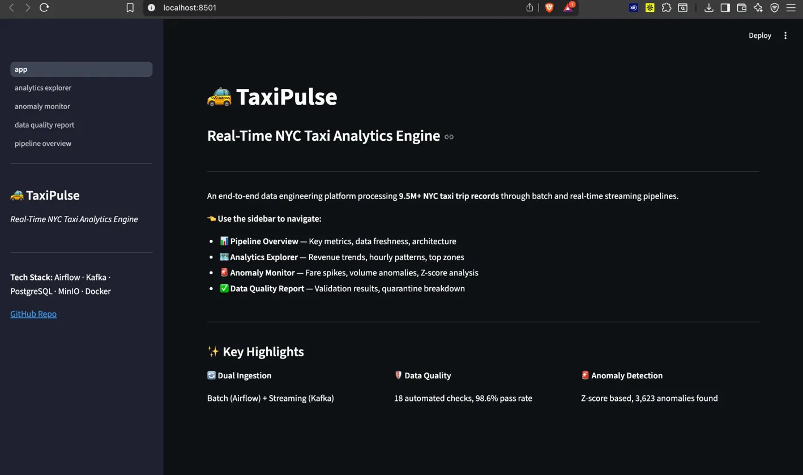

### 📊 Pipeline Overview
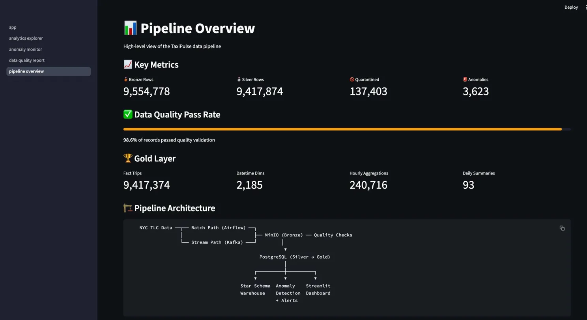

### 🗺️ Analytics Explorer
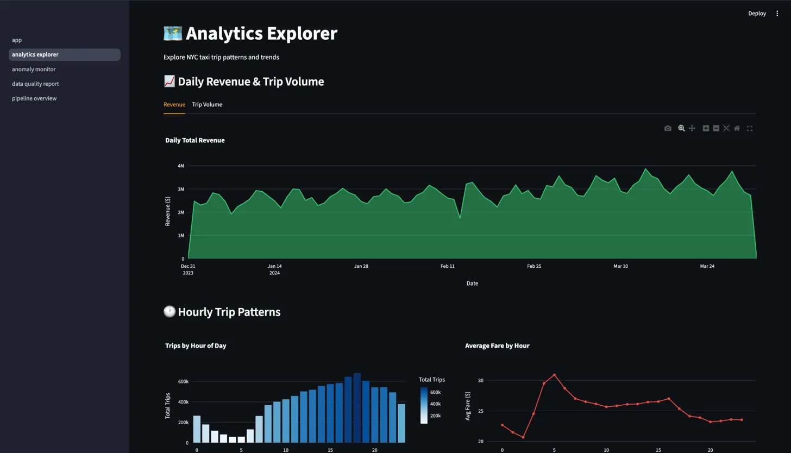
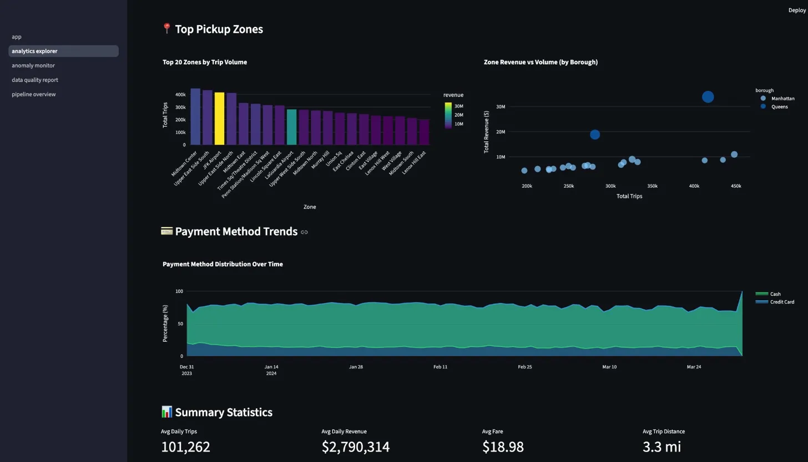

### 🚨 Anomaly Monitor
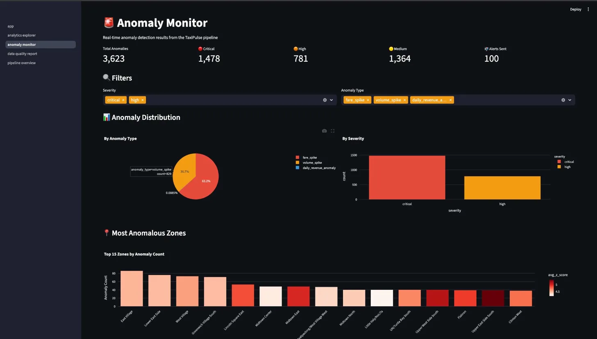
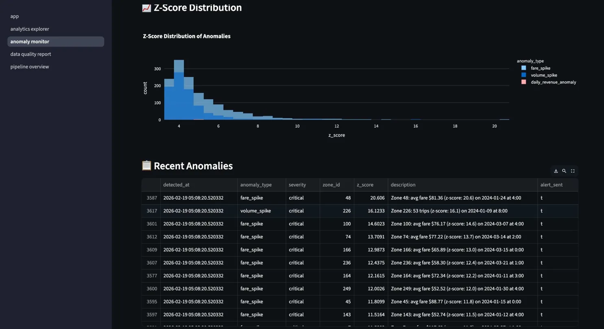

### ✅ Data Quality Report
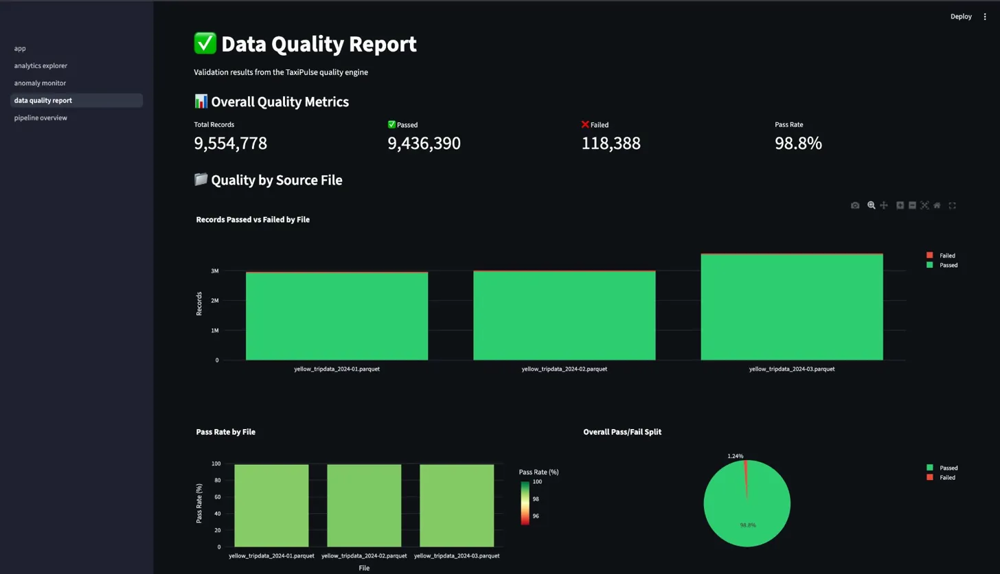
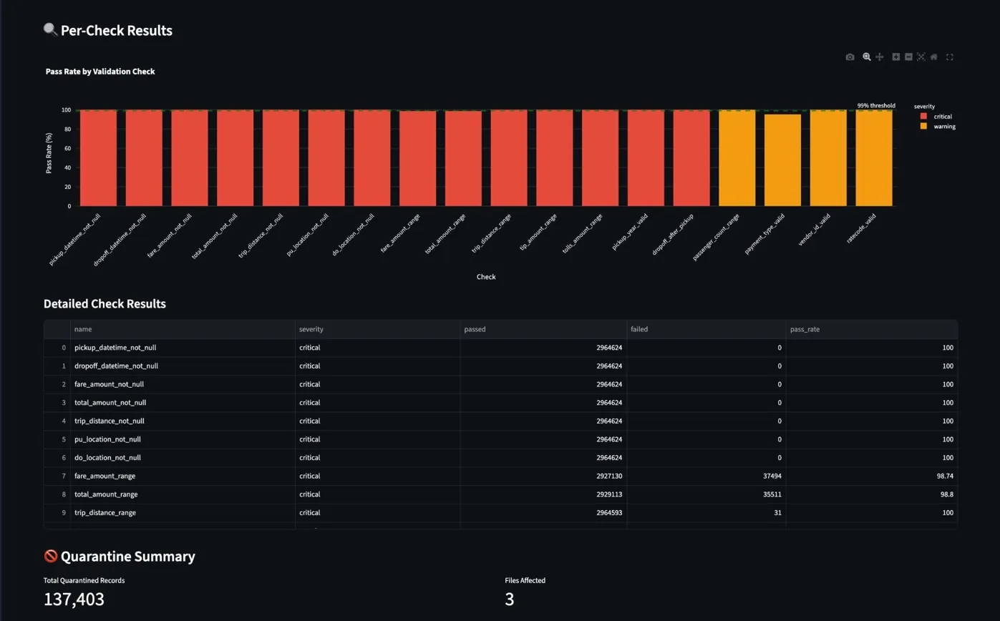

### 🔄 Airflow DAGs
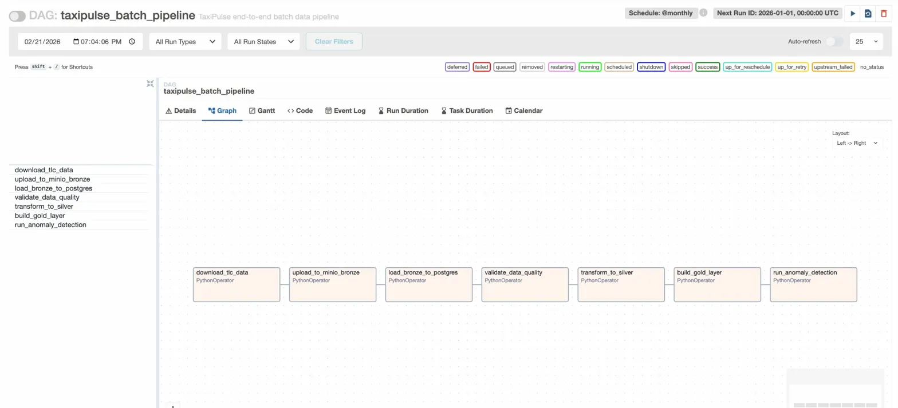
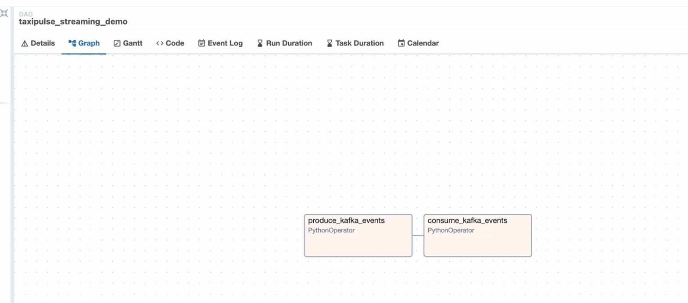

### 🪣 MinIO Data Lake
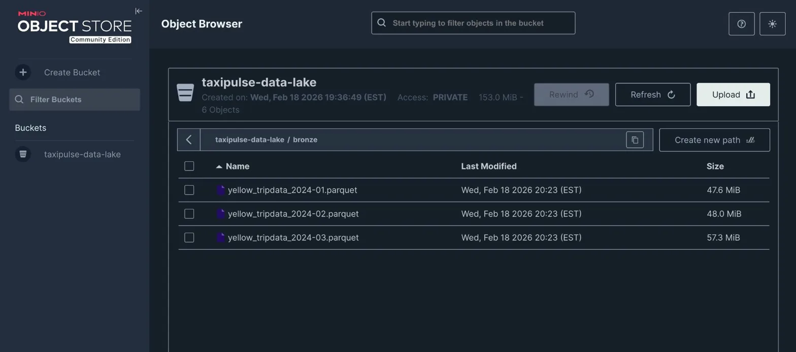

### Slack Alerts


---

## 🏗️ Architecture

```
NYC TLC Data ──┬── Batch Path (Airflow) ──┐
               │                          ├── MinIO (Bronze) ── Quality Checks
               └── Stream Path (Kafka) ───┘         │
                                                     ▼
                                            PostgreSQL (Silver → Gold)
                                                     │
                                          ┌──────────┼──────────┐
                                          ▼          ▼          ▼
                                     Star Schema  Anomaly    Streamlit
                                     Warehouse    Detection  Dashboard
                                                  + Alerts
```

---

## ✨ Key Features

- **Dual Ingestion**: Batch (Airflow) + Real-time streaming (Kafka) pipelines
- **Medallion Architecture**: Bronze → Silver → Gold data layers
- **Automated Data Quality**: 18 validation checks with quarantine system (98.6% pass rate)
- **Star Schema Warehouse**: Fact table + 5 dimensions + pre-computed aggregations
- **Anomaly Detection**: Z-score based fare/volume spike detection (3,623 anomalies found)
- **Slack Alerting**: Real-time notifications for critical anomalies
- **Interactive Dashboard**: 4-page Streamlit app with 15+ charts
- **Fully Containerized**: 8 Docker services, one `docker-compose up` to run everything
- **Tested**: 38 pytest tests with GitHub Actions CI/CD

---

## 📊 Key Metrics

| Metric | Value |
|--------|-------|
| Total records processed | 9,554,778 |
| Quality pass rate | 98.6% |
| Clean Silver records | 9,417,374 |
| Quarantined records | 137,403 |
| Anomalies detected | 3,623 (1,478 critical) |
| Star schema dimensions | 5 |
| Hourly aggregations | 240,716 |
| Docker services | 8 |
| Pytest tests | 38 |

---

## 🛠️ Tech Stack

| Component | Technology |
|-----------|------------|
| **Orchestration** | Apache Airflow |
| **Streaming** | Apache Kafka |
| **Object Storage** | MinIO (S3-compatible) |
| **Data Warehouse** | PostgreSQL |
| **Data Quality** | Custom Python Engine (18 checks) |
| **Anomaly Detection** | Python (scipy, numpy — Z-score) |
| **Alerting** | Slack Webhooks |
| **Containerization** | Docker + Docker Compose |
| **Visualization** | Streamlit + Plotly |
| **Testing** | pytest + GitHub Actions CI/CD |
| **Language** | Python 3.11+ |

---

## 📂 Project Structure

```
TaxiPulse/
├── airflow/                  # Airflow DAGs (batch 7 tasks + streaming 2 tasks)
│   └── dags/
├── ingestion/                # Data ingestion (batch + Kafka streaming)
│   ├── batch/
│   └── streaming/
├── transformations/          # Bronze → Silver → Gold transformations
│   ├── bronze/
│   ├── silver/
│   └── gold/
├── quality/                  # Data quality engine (18 expectations)
│   └── expectations/
├── anomaly_detection/        # Z-score anomaly detection + Slack alerting
├── streamlit_app/            # 4-page monitoring dashboard
│   ├── pages/
│   └── data/                 # Exported CSVs for cloud deployment
├── scripts/                  # Pipeline runner scripts
├── tests/                    # 38 pytest tests (4 modules)
├── docker/                   # Dockerfile for Airflow
├── docs/                     # Documentation and screenshots
├── .github/workflows/        # GitHub Actions CI/CD
├── docker-compose.yml        # 8-service Docker infrastructure
├── Makefile                  # Convenience commands
└── README.md
```

---

## 🚀 Quick Start

### Prerequisites
- Docker Desktop (4GB+ RAM)
- Python 3.11+

### Setup & Run

```bash
# 1. Clone
git clone https://github.com/srujankothuri/TaxiPulse.git
cd TaxiPulse

# 2. Create virtual environment
python -m venv venv
source venv/bin/activate  # Mac/Linux

# 3. Install dependencies
pip install -r requirements.txt

# 4. Configure
cp .env.example .env
# Edit .env: set MINIO_ENDPOINT=localhost:9000, POSTGRES_HOST=localhost, KAFKA_BOOTSTRAP_SERVERS=localhost:29092

# 5. Start infrastructure
docker-compose up -d

# 6. Run complete pipeline (~50 min)
make pipeline

# 7. Load zone names
python scripts/load_zone_names.py

# 8. Launch dashboard
python -m streamlit run streamlit_app/app.py
```

### Access Points

| Service | URL | Credentials |
|---------|-----|-------------|
| Streamlit Dashboard | http://localhost:8501 | — |
| Airflow UI | http://localhost:8080 | admin / admin |
| MinIO Console | http://localhost:9001 | taxipulse / taxipulse123 |
| PostgreSQL | localhost:5432 | taxipulse / taxipulse123 |

### Available Commands

```bash
make help          # Show all commands
make up            # Start Docker services
make down          # Stop Docker services
make pipeline      # Run full batch pipeline
make streaming     # Run Kafka streaming demo
make test          # Run 38 tests
make dashboard     # Launch Streamlit
```

---

## 📊 Data Model (Star Schema)

```
                    ┌──────────────┐
                    │ dim_datetime  │
                    └──────┬───────┘
                           │
┌──────────────────┐  ┌────┴─────┐  ┌──────────────────┐
│ dim_pickup_loc   ├──┤fact_trips├──┤ dim_dropoff_loc   │
└──────────────────┘  └──┬────┬──┘  └──────────────────┘
                         │    │
              ┌──────────┘    └──────────┐
              ▼                          ▼
     ┌────────────────┐       ┌──────────────────┐
     │ dim_payment    │       │ dim_rate_code     │
     └────────────────┘       └──────────────────┘
```

---

## 🔄 Pipeline Flow

```
Batch:     Download → MinIO → Bronze → Validate → Silver → Gold → Anomaly Detection
Streaming: Kafka Producer → Kafka Topic → Consumer → Validate → Silver
```

Both paths feed into the same Silver layer. Gold layer processes all data regardless of source.

---

## 📄 License

This project is licensed under the MIT License — see the [LICENSE](LICENSE) file for details.

---

## 👤 Author

**Venkata Srujan Kothuri**
- GitHub: [@srujankothuri](https://github.com/srujankothuri)
- LinkedIn: [Connect with me](https://linkedin.com/in/your-linkedin)